# <span style=color:DodgerBlue;> Enterprise Service </span>
This service is the primary API consumed by Customer User Interface (CUI) 
and other Internal Services (EIS) to obtain item information.

[](https://dl.circleci.com/status-badge/redirect/circleci/TBVhwa42P1Miy4YXXnJ9KN/FYVztUf4D1xxSEceoqYnj7/tree/main)

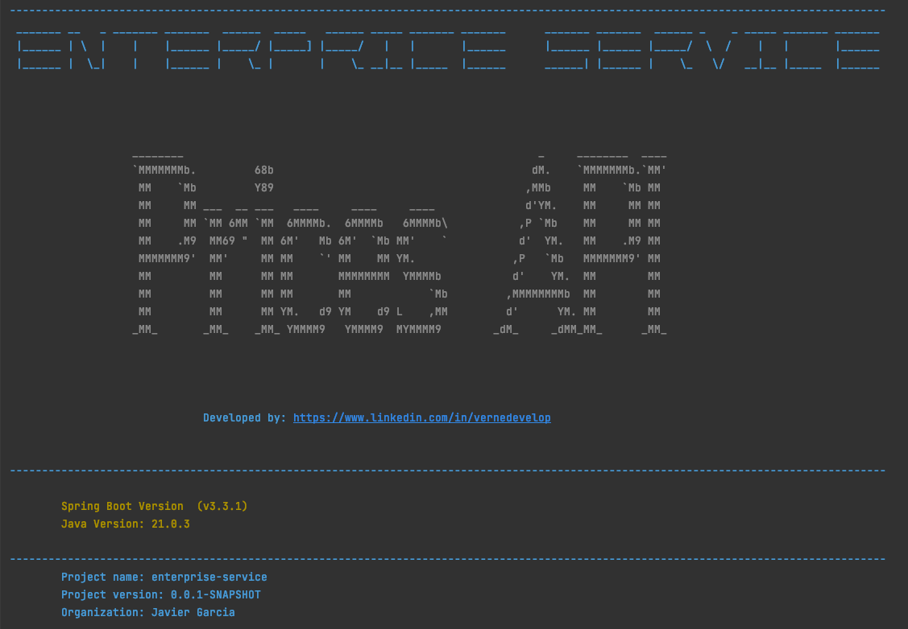


## The purpose of the API

Provide updated price information for an external consumer, 
taking into account the rates applied in a range of dates for a specific product of a given brand.

## The main query endpoint: `/api/v1/prices`

The endpoint for obtaining prices accepts as input parameters: 
application date, product identifier and brand identifier (proposed to go by header)


@GET
`/api/v1/prices?applicationDate=2020-06-14T10:00:00&productId=35455&brandId=1`

From the tabla PRICES, the service will return the price that applies to the product with the given identifier.

|BRAND_ID|START_DATE|END_DATE|PRICE_LIST|PRODUCT_ID|PRIORITY|PRICE|CURR|
|--------|----------|--------|----------|----------|--------|-----|----|
|1|2020-06-14 00:00:00.000|2020-12-31 23:59:59.000|1|35455|0|35.50|EUR|
|1|2020-06-14 15:00:00.000|2020-06-14 18:30:00.000|2|35455|1|25.45|EUR|
|1|2020-06-15 00:00:00.000|2020-06-15 11:00:00.000|3|35455|1|30.50|EUR|
|1|2020-06-15 16:00:00.000|2020-12-31 23:59:59.000|4|35455|1|38.95|EUR|

### Swagger

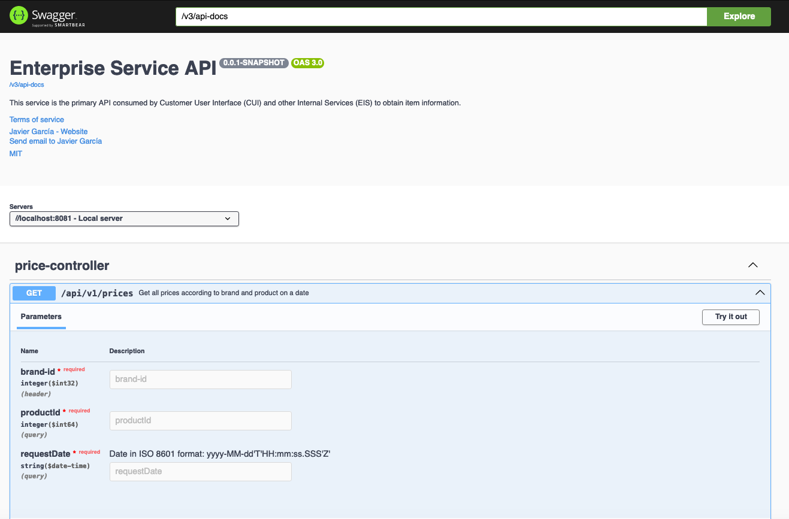

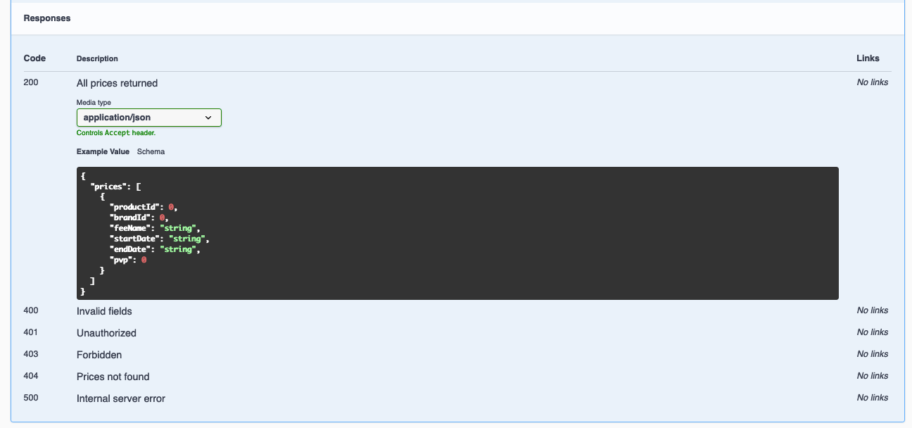

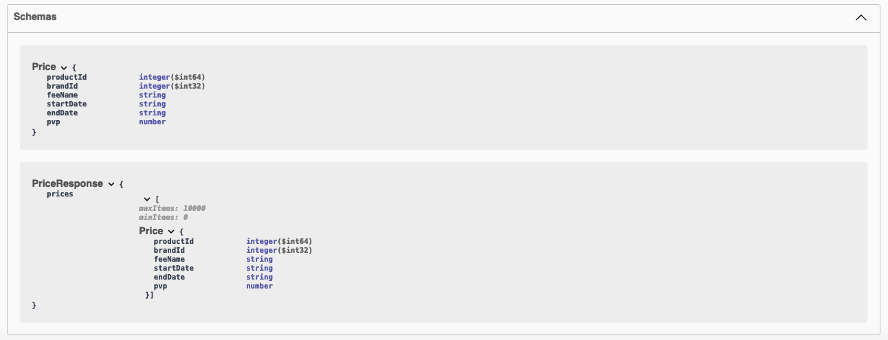

[Access to Swagger UI](http://localhost:8081/swagger-ui/index.html)


## Architecture
This project was built following Hexagonal architecture pattern.

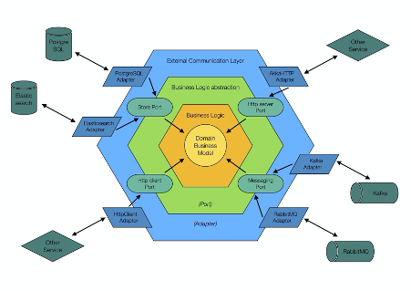

### Hexagonal architecture

This architecture, also called ports and adapters architecture, proposes to divide our application into different layers or domains, each with its own responsibilities, so that they can develop in isolation and each of them is testable and independent of the others.

Directly above the domain layer is the application layer, where the different use cases are defined. When defining the use cases, we think of the interfaces that are available in the application’s hexagon and not of any of the available technologies that we can use.

In this layer, the various requests, that the application receives from the infrastructure layer, are also adapted. For example, a use case accepts input data, coming from the infrastructure layer and executes the necessary actions to return the output data to that layer.


## BBDD
The database is an <span style=color:DeepSkyBlue;>*_H2 in-memory database_*</span>, for testing locally.
The schema is created at the start of the application and the data is loaded from the files `.sql`.

The schema is created at the beginning of the application and the data is loaded 
by migration (<span style=color:Coral;>*_Flyway_*</span> is used for this). The data is loaded from the files `.sql`.
> **NOTE:**   The main table lacks a unique identifier, so it has been proposed to take several fields as primary key 
(just as old business management systems did). In some cases, to obtain data in this type of table, 
it is advisable to use native SQL to check that the type conversion is correct, since in some DBMSs it could cause problems.


### Database schema
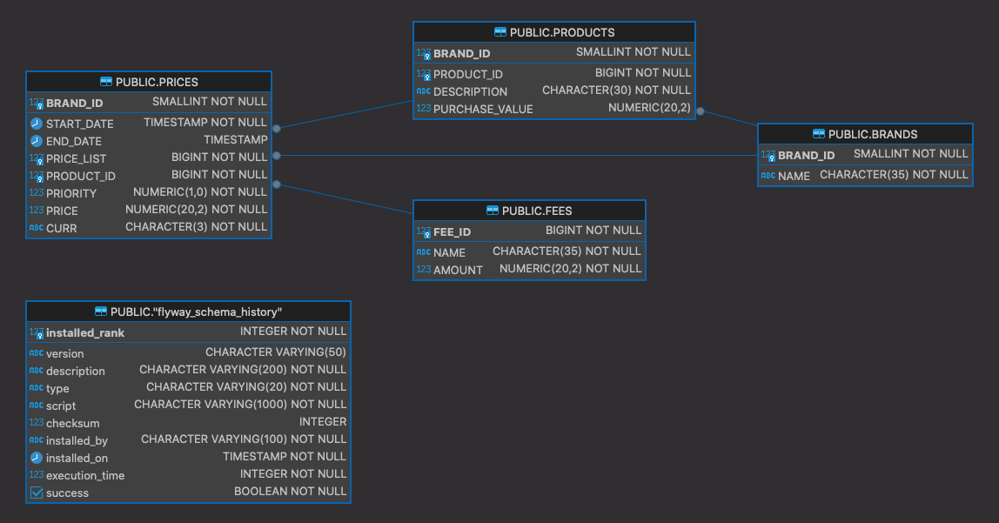

### Prices table
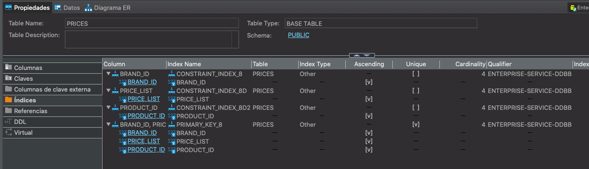

### Prices Primary keys
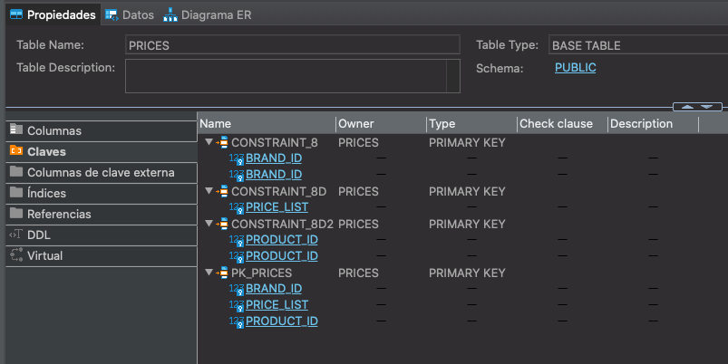

### Prices Foreign keys
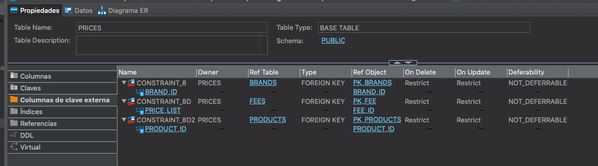

### Prices Data
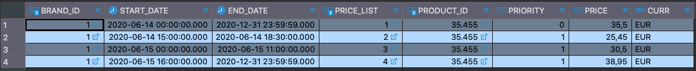

[Access to bbdd by h2_console](http://localhost:8081/h2-console/)


CONECTION DATA:
* *JBBC URL*: `jdbc:h2:./db/enterprise-service-ddbb;DB_CLOSE_DELAY=-1;AUTO_SERVER=TRUE;`

* <span style= color:red;>No user, No Password<span>


## Testing

### Unit Testing


### Integration Testing

### Postman

In <span style=color:DarkOrange;>*_Postman_*</span> we have created a collection with the different tests that can be done to the service. 
And the results of the tests are saved in the folder `newman_report`. The comamnd to run the tests is:

```shell
newman run postman/Enterprise-Service.postman_collection.json -e postman/Enterprise-Service.postman_environment -r htmlextra --reporter-htmlextra-export postman/newman_report/Enterprice-Service-report.html
```
Note: The environment file is not necessary, but it is used to define the variables that are used in the tests. And you need to have the newman installed.

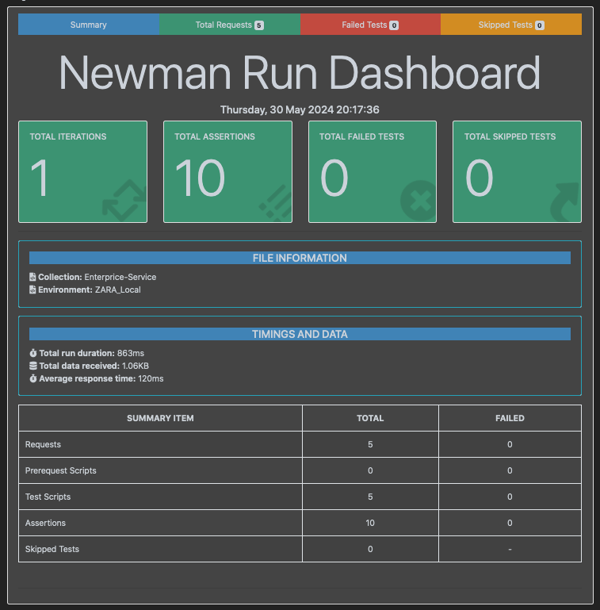

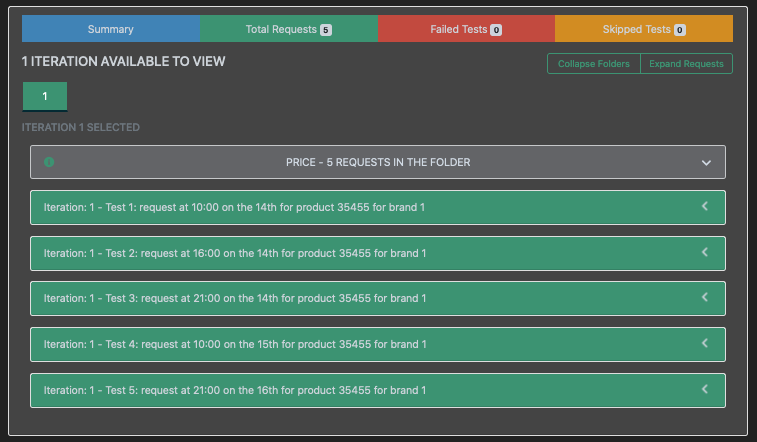

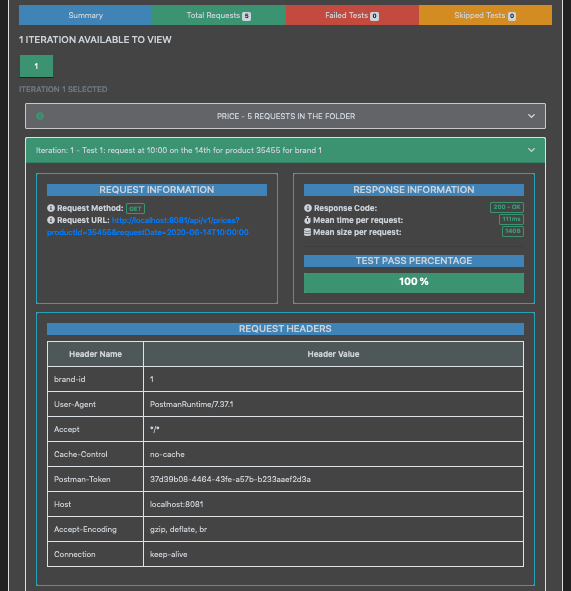

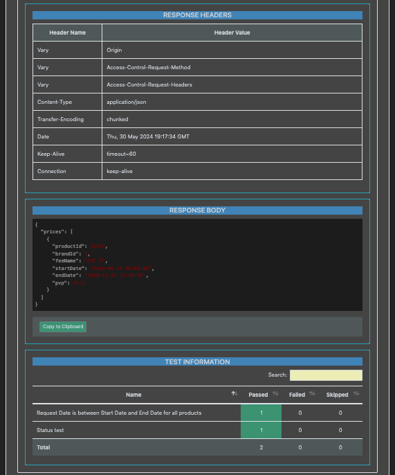

[View full report](postman/newman_report/Enterprice-Service-report.html)


### CircleCI

The project has been configured with <span style=color:Violet;>*_CircleCI_*</span> 
to run the tests and check the status of the project.


### SonarCloud

The project has been configured with <span style=color:red;>*_SonarCloud_*</span>. 
And teh plugin <span style=color:lightred;>*_SonarLint_*</span> has been installed in the IDE.

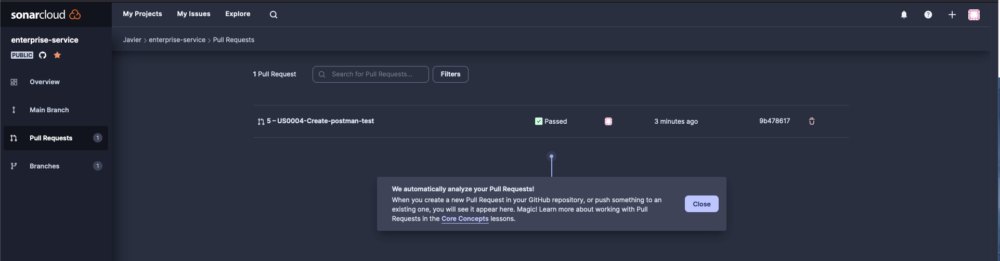

Used for fixing code smells, bugs, and security vulnerabilities.

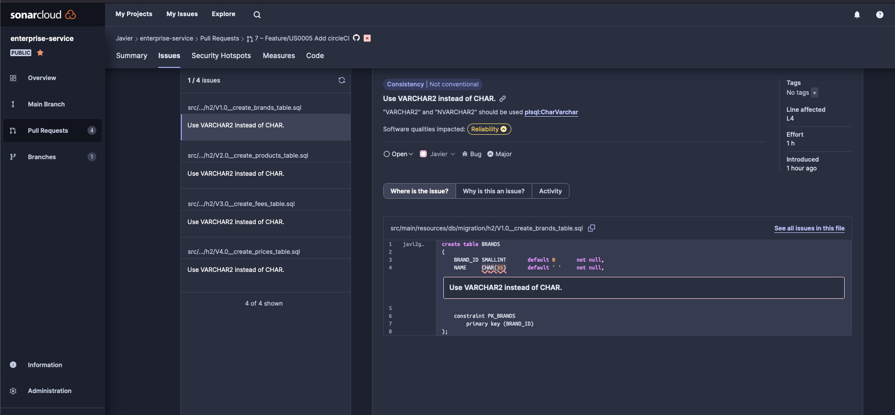

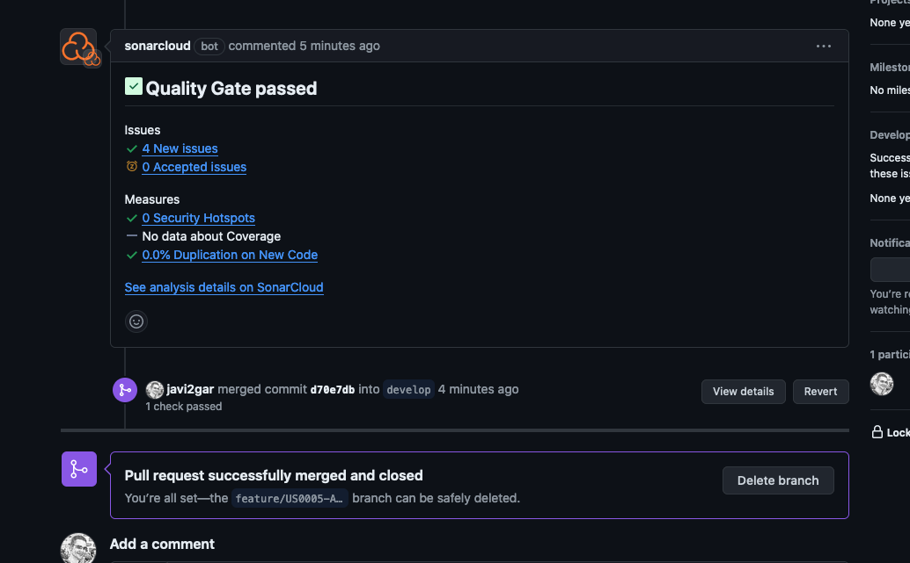

