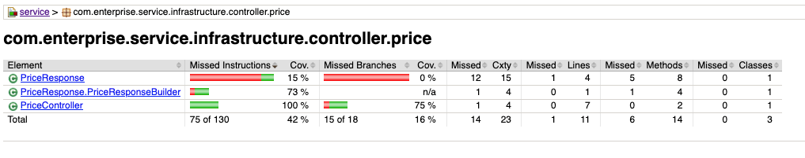
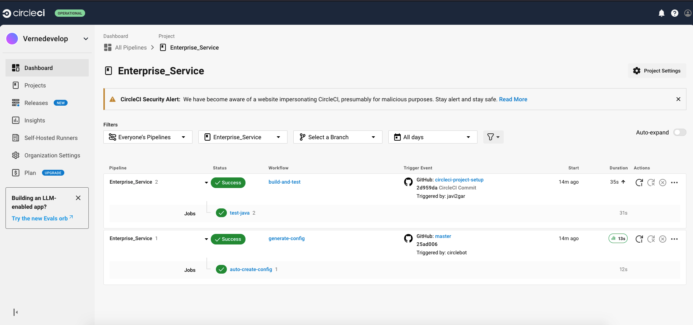

# <span style=color:DodgerBlue;> Enterprise Service </span>
This service is the primary API consumed by Customer User Interface (CUI) 
and other Internal Services (EIS) to obtain item information.

[](https://dl.circleci.com/status-badge/redirect/circleci/TBVhwa42P1Miy4YXXnJ9KN/FYVztUf4D1xxSEceoqYnj7/tree/main)


## The purpose of the API

Provide updated price information for an external consumer, 
taking into account the rates applied in a range of dates for a specific product of a given brand.

## The main query endpoint: `/api/v1/prices`

The endpoint for obtaining prices accepts as input parameters: 
application date, product identifier and brand identifier (proposed to go by header)


@GET
`/api/v1/prices?applicationDate=2020-06-14T10:00:00&productId=35455&brandId=1`

From the tabla PRICES, the service will return the price that applies to the product with the given identifier.

|BRAND_ID|START_DATE|END_DATE|PRICE_LIST|PRODUCT_ID|PRIORITY|PRICE|CURR|
|--------|----------|--------|----------|----------|--------|-----|----|
|1|2020-06-14 00:00:00.000|2020-12-31 23:59:59.000|1|35455|0|35.50|EUR|
|1|2020-06-14 15:00:00.000|2020-06-14 18:30:00.000|2|35455|1|25.45|EUR|
|1|2020-06-15 00:00:00.000|2020-06-15 11:00:00.000|3|35455|1|30.50|EUR|
|1|2020-06-15 16:00:00.000|2020-12-31 23:59:59.000|4|35455|1|38.95|EUR|

### Swagger


[Access to Swagger UI](http://localhost:8081/swagger-ui/index.html)


## Architecture
This project was built following Hexagonal architecture pattern.


### Hexagonal architecture

This architecture, also called ports and adapters architecture, proposes to divide our application into different layers or domains, each with its own responsibilities, so that they can develop in isolation and each of them is testable and independent of the others.

Directly above the domain layer is the application layer, where the different use cases are defined. When defining the use cases, we think of the interfaces that are available in the application’s hexagon and not of any of the available technologies that we can use.

In this layer, the various requests, that the application receives from the infrastructure layer, are also adapted. For example, a use case accepts input data, coming from the infrastructure layer and executes the necessary actions to return the output data to that layer.


## BBDD
The database is an <span style=color:DeepSkyBlue;>*_H2 in-memory database_*</span>, for testing locally.
The schema is created at the start of the application and the data is loaded from the files `.sql`.

The schema is created at the beginning of the application and the data is loaded 
by migration (<span style=color:Coral;>*_Flyway_*</span> is used for this).
> **NOTE:**   The main table lacks a unique identifier, so it has been proposed to take several fields as primary key 
(just as old business management systems did). In some cases, to obtain data in this type of table, 
it is advisable to use native SQL to check that the type conversion is correct, since in some DBMSs it could cause problems.


### Database schema


### Prices table


### Prices Primary keys


### Prices Foreign keys


### Prices Data


[Access to bbdd by h2_console](http://localhost:8081/h2-console/)


CONECTION DATA:
* *JBBC URL*: `jdbc:h2:./db/enterprise-service-ddbb;DB_CLOSE_DELAY=-1;AUTO_SERVER=TRUE;`

* <span style= color:red;>No user, No Password<span>


## Testing

### Unit Testing


* Repository layer (@DataJpaTest): <span style=color:yellow;>*_JUnit_*</span> is used for unit testing 

    


* Service layer (@SpringBootTest): <span style=color:GreenYellow;>*_Mockito_*</span> is used for unit testing

    


* Controller layer (@WebMvcTest): <span style=color:LightGreen;>*_MockMvc_*</span> is used for unit testing

    


### Integration Testing

### Coverage Testing

On the next image, you can see the coverage of the tests. The <span style=color:SeaBlue;>*_IntelliJ IDEA_*</span> 
generated the report of the coverage of the tests.


You can export this report press the right button and select the option `Export Coverage Data`. 
And the report is saved in the folder `exportToHTML/index.html`.


### JaCoCo
The project has been configured with <span style=color:LightGreen;>*_JaCoCo_*</span> to check the coverage of the tests.

And the coverage report is saved in the folder `target/site/jacoco/index.html`.

[View full report](target/site/jacoco/index.html)



### Postman

In <span style=color:DarkOrange;>*_Postman_*</span> we have created a collection with the different tests that can be done to the service. 
And the results of the tests are saved in the folder `newman_report`. The comamnd to run the tests is:

```shell
newman run postman/Enterprise-Service.postman_collection.json -e postman/Enterprise-Service.postman_environment -r htmlextra --reporter-htmlextra-export postman/newman_report/Enterprice-Service-report.html
```
Note: The environment file is not necessary, but it is used to define the variables that are used in the tests. And you need to have the newman installed.


[View full report](postman/newman_report/Enterprice-Service-report.html)


## API Security Audit

The results of the **security audit are very low**, and the _**<span style=color:red;> API is not secure**_</span> , it's necessary to improve the 
security of the API. For example, librearies like <span style=color:LightGreen;>*_Spring Security_*</span> 
can be used to secure the API, or <span style=color:LightGreen;>*_JWT_*</span> to secure the endpoints.

### 42Crunch

The project has been configured with <span style=color:pink;>*_42Crunch_*</span> to check the security of the API.


### CircleCI

The project has been configured with <span style=color:Violet;>*_CircleCI_*</span> 
to run the tests and check the status of the project.




### SonarCloud

The project has been configured with <span style=color:red;>*_SonarCloud_*</span>. 
And teh plugin <span style=color:lightred;>*_SonarLint_*</span> has been installed in the IDE.


Used for fixing code smells, bugs, and security vulnerabilities.


## Installation

### Clone the repository

```shell
git clone https://github.com/javi2gar/enterprise-service.git
``` 

### Requirements

* Java 17
* Maven

### Run the project
Go to the root of the project and run the following command:

```shell
mvn spring-boot:run
```


### Environment variables
The environment variables are defined in the file `application.properties`.
This project is configured to run on port 8081. And the database is an H2 in-memory database.
IS for local testing, for production it is recommended to use a database server, and configure t
he connection in the file `application.properties`, or add separated files of configuration by environment, 
by example `application-dev.properties`, `application-prod.properties`,
and use environment variables, and use the command `--spring.profiles.active=dev` or `--spring.profiles.active=prod`.

You can hide the sensitive data in the file `application.properties` and use environment variables. 
For example, the database password, the secret key, etc.
In thi case you can hide on file .env and use the library dotenv to read the file .env and load the environment variables.


### Run tests

```shell
mvn test
```

### Run coverage tests

```shell
mvn test jacoco:report
```


Access to the file `target/site/jacoco/index.html` to see the coverage report.


### Run Postman tests

```shell
newman run postman/Enterprise-Service.postman_collection.json -e postman/Enterprise-Service.postman_environment
```

### Logs and errors

The logs are saved in the file `enterprise-service.log` in the root of the project. And the errors are shown in the console.


